# **Creating a Load Balancer Lab with Nginx and Multiple Vagrant Servers**

## **Objective**
To create a load balancer lab using **Nginx** with **three web servers** and **one load balancer server**. The goal is to demonstrate how Nginx distributes traffic using a round-robin strategy.

---

## **Step 1: Prerequisites**
I Installed and verified the following:
```bash
VBoxManage --version   # should display VirtualBox version
Vagrant --version      # should display Vagrant version
```

---

## **Step 2: Create Project Directory**
```bash
cd C:\Users\PC\Documents\workspace
mkdir load_balancer_lab
cd load_balancer_lab
```

### I added Screenshots
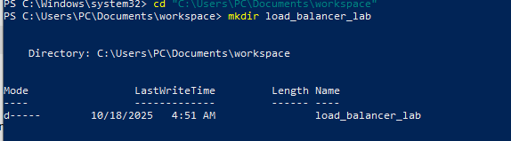

---

## **Step 3: Create the Vagrantfile**
Create a single **Vagrantfile** that defines four VMs:

```ruby
Vagrant.configure("2") do |config|
  # Web Server 1
  config.vm.define "web1" do |web1|
    web1.vm.box = "ubuntu/bionic64"
    web1.vm.hostname = "web1"
    web1.vm.network "private_network", ip: "192.168.56.11"
    web1.vm.provision "shell", inline: <<-SHELL
      sudo apt update -y
      sudo apt install -y nginx
      echo "This is Web Server 1" | sudo tee /var/www/html/index.html
      sudo systemctl restart nginx
    SHELL
  end

  # Web Server 2
  config.vm.define "web2" do |web2|
    web2.vm.box = "ubuntu/bionic64"
    web2.vm.hostname = "web2"
    web2.vm.network "private_network", ip: "192.168.56.12"
    web2.vm.provision "shell", inline: <<-SHELL
      sudo apt update -y
      sudo apt install -y nginx
      echo "This is Web Server 2" | sudo tee /var/www/html/index.html
      sudo systemctl restart nginx
    SHELL
  end

  # Web Server 3
  config.vm.define "web3" do |web3|
    web3.vm.box = "ubuntu/bionic64"
    web3.vm.hostname = "web3"
    web3.vm.network "private_network", ip: "192.168.56.13"
    web3.vm.provision "shell", inline: <<-SHELL
      sudo apt update -y
      sudo apt install -y nginx
      echo "This is Web Server 3" | sudo tee /var/www/html/index.html
      sudo systemctl restart nginx
    SHELL
  end

  # Nginx Load Balancer
  config.vm.define "nginx" do |nginx|
    nginx.vm.box = "ubuntu/bionic64"
    nginx.vm.hostname = "nginx"
    nginx.vm.network "private_network", ip: "192.168.56.10"
    nginx.vm.provision "shell", inline: <<-SHELL
      sudo apt update -y
      sudo apt install -y nginx
    SHELL
  end
end
```

---

## **Step 4: Create Provisioning Scripts**
I Created provisioning scripts for Nginx and the web servers.
Run:
```bash
sudo nano nginx.sh
```
and 
```bash
sudo nano webserver.sh
```


### I added screenshots
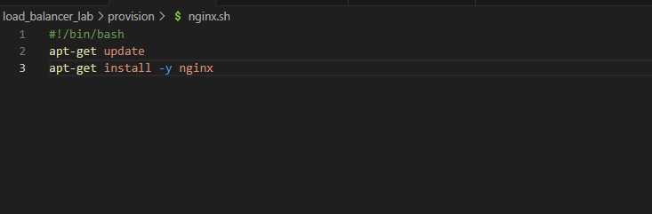
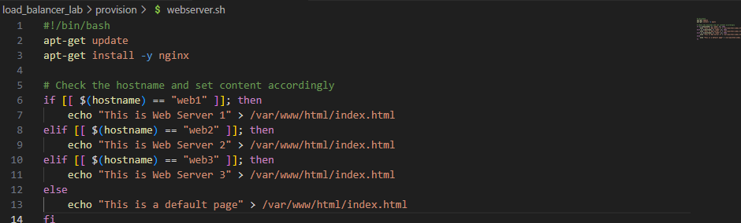

---


## **Step 5: Start All Virtual Machines**
Run:
```bash
vagrant up
```

Verify that all machines are running:
```bash
vagrant status
```

### I added screenshots
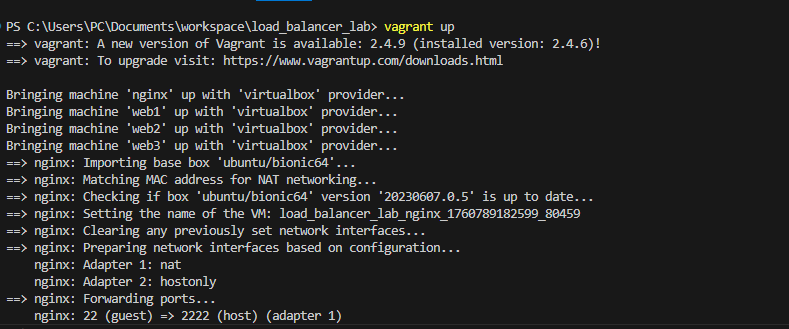

---

## **Step 5: Configure the Nginx Load Balancer**
SSH into the Nginx VM:
```bash
vagrant ssh nginx
```

Edit the default configuration:
```bash
sudo nano /etc/nginx/sites-available/default
```

Replace the content inside the `server` block with:
```nginx
upstream web_servers {
    server 192.168.56.11;
    server 192.168.56.12;
    server 192.168.56.13;
}

server {
    listen 80 default_server;
    listen [::]:80 default_server;

    location / {
        proxy_pass http://web_servers;
    }
}
```

Save and exit the file.  
Then restart Nginx:
```bash
sudo systemctl restart nginx
sudo systemctl status nginx
```

### I added screenshots


---

## **Step 6: Test Load Balancing from Nginx**
Run multiple curl commands from the **nginx VM**:
```bash
curl http://localhost
curl http://localhost
curl http://localhost
```

Expected output:
```
This is Web Server 1
This is Web Server 2
This is Web Server 3
```

### I added screenshots
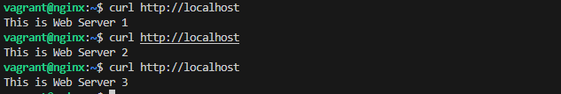

---

## **Step 7: Verify Load Balancing in Logs**
SSH into each web server and check access logs:

```bash
vagrant ssh web1
sudo tail -f /var/log/nginx/access.log
```
Repeat for `web2` and `web3`.  
You should see requests coming from the Nginx load balancer (IP `192.168.56.10`).


### I added screenshots
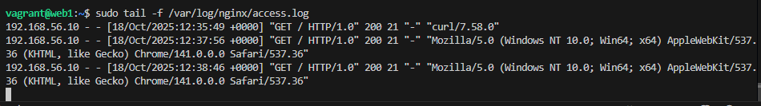
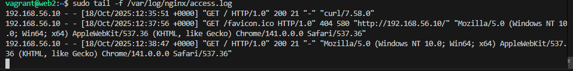
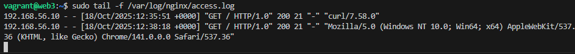

---

## **Step 8: Test in a Web Browser**
1. On your host machine, open a web browser.  
2. Go to `http://192.168.56.10` (Nginx load balancer’s private IP).  
3. Refresh several times — the displayed message should alternate between:  
   - *This is Web Server 1*  
   - *This is Web Server 2*  
   - *This is Web Server 3*


### I added screenshots
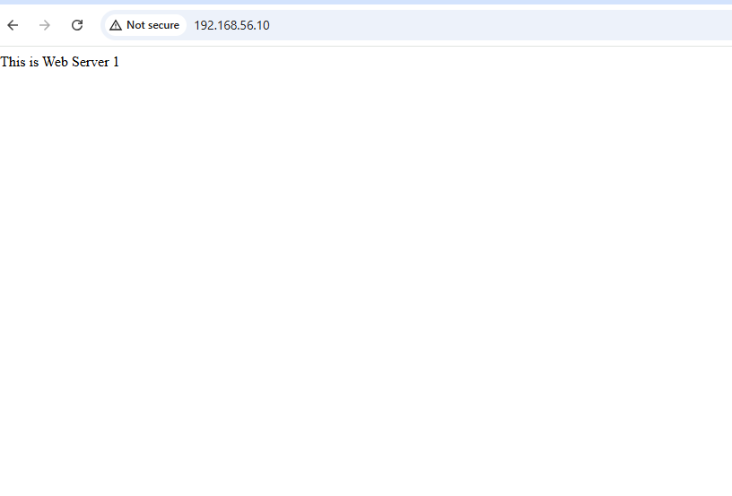
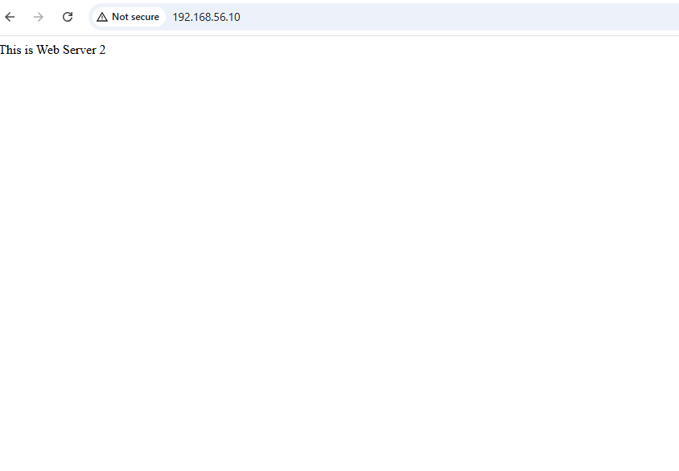
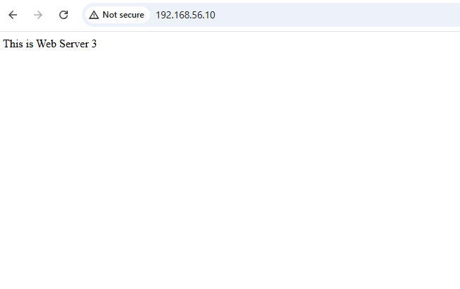

---


 **Conclusion**
I have successfully:
- Created multiple web servers using Vagrant  
- Configured Nginx as a load balancer  
- Verified traffic distribution via round-robin  
- Demonstrated working load balancing through curl and browser testing  
